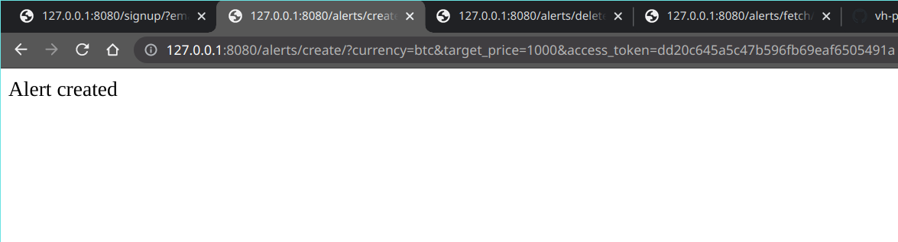
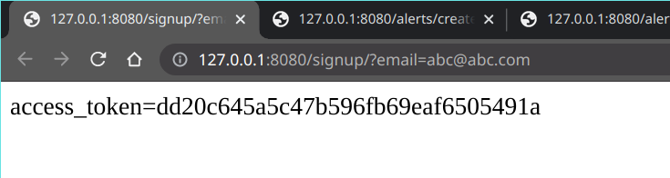
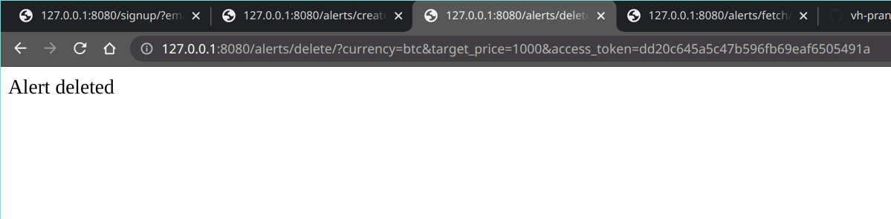
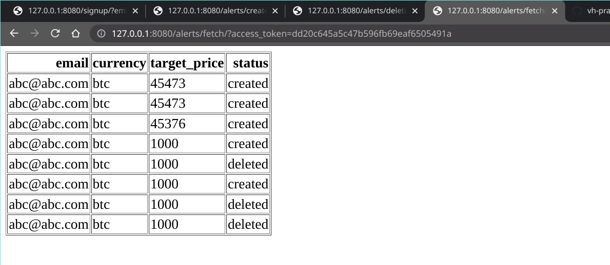
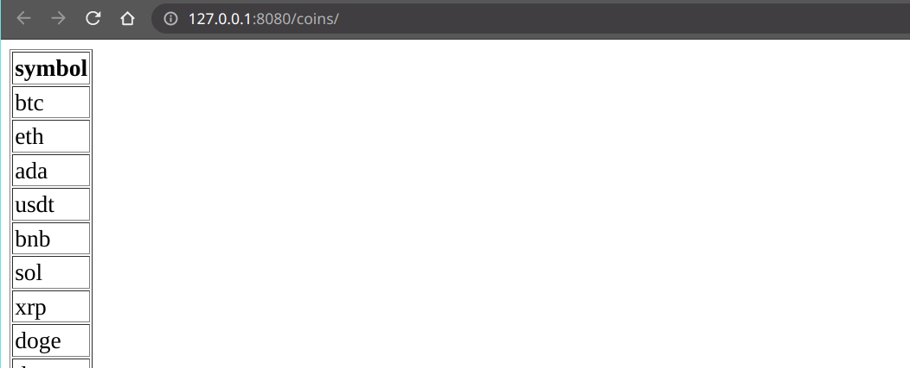
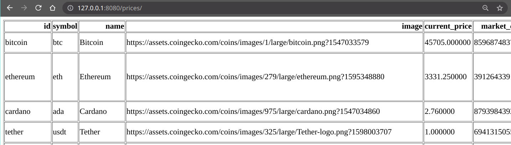

# Krypto_task

## How to run the project:

To clone the repository: \
`git clone https://github.com/vh-praneeth/Krypto_task` \
`cd Krypto_task` to go to that directory

To install the requirements: \
`python3 -m pip install -r requirements.txt`

Before running the code: \
execute `python3 redis_worker.py` in a new terminal and minimize the terminal \
do the same with `python3 pinger.py`

To run the code: \
`python3 flask_app.py`

Note: API calls may be slow because of sending data to database. To increase the speed, kindly remove the lines which store data in DB. \
Flask app start may be slow due to restoration of tables from the database.

## API Endpoints

`/alerts/create/` creates alert \
`/alerts/delete/` deletes an alert \
`/alerts/fetch/` fetches the alert history \
`/signup/` to signup with email \
`/update/` to check the new prices and send the alert to the users. This is created to be called by `pinger.py` \
`/coins/` to get list of coins \
`/prices/` to get prices and details of all the coins

## API usage

After http://127.0.0.1:8080, add the following

`/signup/?email=abc@abc.com` to signup with email

`/alerts/create/?currency=btc&target_price=1000&access_token=<access-token>` to create alert with BTC at target price of 1000

`/alerts/delete/?currency=btc&target_price=1000&access_token=<access-token>` to create alert with BTC which has been set with a target price of delete

`/alerts/fetch/?access_token=<access-token> `to fetch alerts. It returns a HTML page with the history of `create, delete, trigger`

`/coins/` to get list of coins

`/prices/` to get prices and details of all the coins

`/update/` to check the new prices and send the alert to the users. This is made to be called by `pinger.py`

## My approach
In the Python Flask app code, I created a class named `var` to store the variables. \
I used Redis Online and Heroku's Postgresql for hosting them online. \
Pinger loads `localhost:8080/update/` of Flask app every 5 minutes. Flask app will then fetch the new prices of all the coins and sends the alerts to the users' email address.\
The file send_email.py contains the code required to send an email.

All the tables are stored in Pandas DataFrame. When any dataframe is updated, database will be updated immediately from the dataframe. It may cause delay. \
When the program starts, it restores the old data from the database. It may cause delay.

When there is an alert to be sent to the user, it is added to the Redis queue. Then `redis_worker.py` receives the task and sends an email to the user.

At any request, we find the email address using the access token.

### How the code notifies using active alerts:
When alert is created, it compares the target price with current price. It will decide whether the user wants to be notified about increase or decrease in the price.
For each active alert entry, it checks the current prices of the given currency.
If the new price is same as the target price, user gets notified.
If the user targeted for increase and new price is greater than target price, user gets notified.
Or if the user targeted for decrease and new price is less than the target price, user gets notified.

### Note
I was not informed about the extension of deadline till 10 AM. I couldn't improve the code. \
If you want to allow me to improve code or if you want any improvements, kindly send an email. I gained experience during my internships with Python, Flask, and APIs.

## Screenshots
### Create

### Signup

### Delete

### Fetch

### Coins

### Prices

